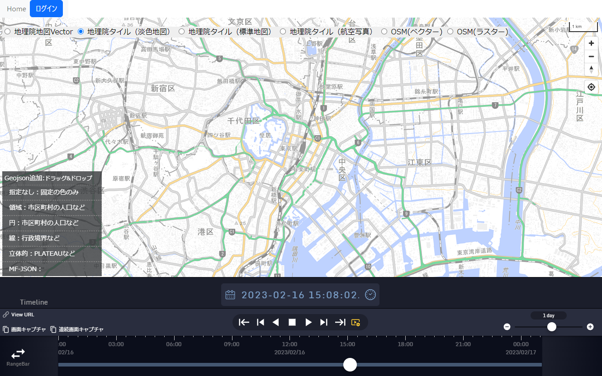
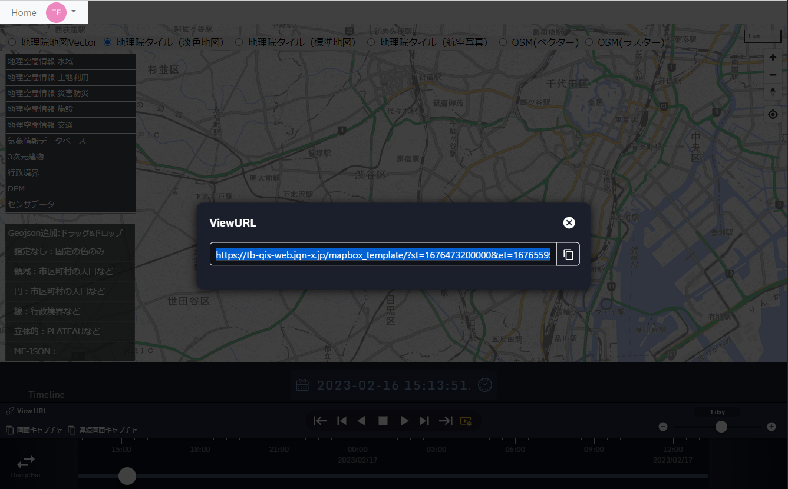

# 時系列・地理空間情報に関するデータ分析・可視化システムの試作と実装マニュアル

## WebGISアプリケーション

### 2次元・2.5次元WebGISアプリケーション

#### アプリケーションの起動
ブラウザからhttps://tb-gis-web.jgn-x.jp/mapbox_template/ にアクセスする。
すると下記のような画面が表示される。

#### ログイン
機能詳細：
本システムに事前に登録してあるユーザ情報でログインする。ログインすることで、各レイヤを選択および表示することができる。
本システムにすでにログインしており、有効時間以内であれば、自動ログインされる。

手順：
画面左上の「ログイン」ボタンを押す。

下記のような画面が表示され、ユーザ名またはメールアドレス、およびパスワードを入力し、「続ける」ボタンを押す。

下記のようにメニューバーが表示される。

#### 基盤地図変更
機能詳細：
表示されている基盤地図を選択し変更する。

手順：
変更したい基盤地図のラジオボタンを選択する。

下記は地理院地図Vectorを選択

#### レイヤ表示・非表示
機能詳細：画面地図上に選択したレイヤを表示・非表示する。

手順：表示したいレイヤ名を選択（*ダブルクリック*）する

レイヤの透明度を変更するには、ワンクリックしたままスライダーを移動する。（現時点では文字が記載されていないところを最初にクリックする必要がある）

非表示にするには、再度ダブルクリックする。

****
#### タイムライン機能
本アプリケーションには、タイムスライダーが組み込んである。機能詳細は同項を参照。
##### 日付の変更

地図下部に表示されているカレンダーアイコンをクリックすると、下記のようなカレンダーが表示され、日付を変更できる。

##### 時刻の変更
時計アイコンをクリックすると、時刻が現在時刻に更新される。

再度、時計アイコンをクリックすると、アイコンが点滅し、現在時刻に更新され続ける。

##### タイムスライダーの再生

再生設定アイコンをクリックすると、下記の再生設定メニューが表示される。

再生設定内の「再生モード」、「再生間隔」/「再生速度」、「コマ送り間隔」を設定し、再生ボタンをクリックすると、設定に従っ たタイムラインが再生される。

再生中に再生間隔を変更すると即時反映される。

初期設定は下記の通り。

|    |    |
| ---- | ---- |
| 再生モード |  「コマ送り」  |
| 再生間隔 |  1sec  |
| コマ送り間隔 |  1f/1min  |

##### タイムスライダーで日付と時間の変更
地図下部にあるタイムスライダーのつまみを移動すると、時刻が変更される。

#### その他の機能
##### 画面キャプチャ

「画面キャプチャ」ボタンをクリックすると、ディスプレー画面全体やブラウザに表示された画面のスクリーンショット画像がダウンロードされる。

下記のように、「タブ」を選択し、「共有」ボタンを押すとブラウザの画像がダウンロードされる。

##### 連続画面キャプチャ
本アプリケーションには、連続画像キャプチャが組み込んである。機能詳細は同項を参照。

「連続画面キャプチャ」ボタンをクリックし、開始後、各再生ボタンをクリックすると、ディスプレー画面全体やブラウザに表示された画面のスクリーンショット画像が連続でダウンロードされる。

##### ViewURL
本アプリケーションには、ViewURLが組み込んである。機能詳細は同項を参照。

「ViewURL」ボタンをクリックすると、表示されている画面の情報を保持したURLが表示される。

URL右側のアイコンを押すと、URLがコピーされる。

##### 地図の拡縮など

|                      |                                                      |
|----------------------|------------------------------------------------------|
|アイコン              |説明                                                  |
||地図を拡大する                                        |
||地図を縮小する                                        |
||地図の方位を変更する                                  |
||現在位置に移動する（ボタン押下後、用許可した場合のみ）|

### 人口動態等可視化Webアプリケーション
#### アプリケーションの起動
ブラウザからhttps://tb-gis-web.jgn-x.jp/mapbox_sample/ にアクセスする。
すると下記のような画面が表示される。

#### ログイン
機能詳細：
本システムに事前に登録してあるユーザ情報でログインする。各レイヤを選択、表示することができる。
本システムにすでにログインしており、有効時間以内であれば、自動ログインされる。

手順：
画面左上の「ログイン」ボタンを押す。

下記のような画面が表示され、ユーザ名またはメールアドレス、およびパスワードを入力し、「続ける」ボタンを押す。

下記のようにメニューバーが表示される。

#### 基盤地図変更
機能詳細：
表示されている基盤地図を選択し変更する。

手順：
変更したい基盤地図のラジオボタンを選択する。
下記は地理院地図Vectorに変更したもの

#### レイヤ表示・非表示
機能詳細：
画面地図上に選択したレイヤを表示・非表示する。

手順：
表示したいレイヤ名を選択（*ダブルクリック*）する。

（下記は、「行政境界」 &gt; 「人口（市区町村・複数年）」を選択）

（上記は、立体グラフを見やすくするため、角度を変更している。）

他の機能（タイムライン機能、その他機能（画面キャプチャ、ViewURL））は、「3次元WebGISアプリケーション」と 同様であり、該当項目を参照。